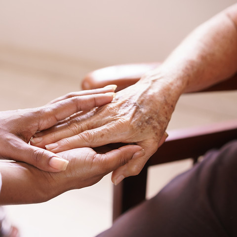

## What is an End-of-Life Doula?

End-of-Life Doulas provide support, companionship, comfort, and guidance to people approaching the end of life and to those close to them. They can help people make informed decisions with a clear understanding of available resources and options.

## Support

Doulas are trained to provide holistic, non-medical support and to help ensure that the wishes and needs of the dying person are honoured.

## Comfort

A Doula can be involved at any stage of the journey, from initial diagnosis to the final breath. One of the most valuable parts of the role is helping the person clarify emotions and express wishes.

## Guidance

When needed, a Doula can act as a bridge between the person and their loved ones, helping create a calm environment in the final weeks and days and supporting more meaningful, positive memories.

## Speak with the Doula

Carla Cavaco  
[carla.cavaco00@gmail.com](mailto:carla.cavaco00@gmail.com)  
[+351 924 884 813](tel:+351924884813)

