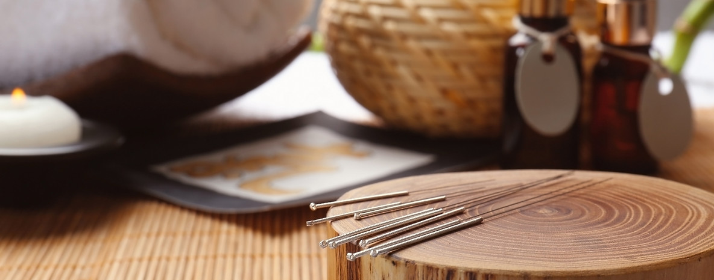

## Volunteers

Pomba Branca is a free community service, carried out by dedicated and compassionate people on a voluntary basis. Volunteers help run the Cafés da Saudade, coordinate activities and events, and support administration.

## How to Take Part

Pomba Branca is a community initiative, bringing together people from different backgrounds and with different skills, able to communicate in different languages and respond to varied needs.

Together, we can expand and strengthen our community:

- Volunteering
- Sponsorship
- Partnerships

[Contact us to learn more](contact)

## Community Resources

Pomba Branca has identified a network of individuals and professionals who offer holistic health therapies that complement traditional healthcare and may bring comfort to people at the end of life or in grief.

These services may include counselling, acupuncture, yoga, Tai Chi, bodywork, and energy work. People can be referred to services that best fit their needs.

Services are arranged with and paid directly to the providers. Although these collaborators share Pomba Branca’s vision, they are not employees and have no legal or financial relationship with Pomba Branca.

[Contact us to learn more](contact)

## Become a Companion

What makes our [companionship programme](loneliness-support) valuable is that the benefits flow both ways: between the person seeking support and the person offering it.

Listening opens us to other people’s stories as we learn to listen without judgement. Accompanying others brings the satisfaction of helping weave a circle of care in our community.

All you need is the desire to help someone; we provide training for the rest.

[Contact us to learn more](contact)

