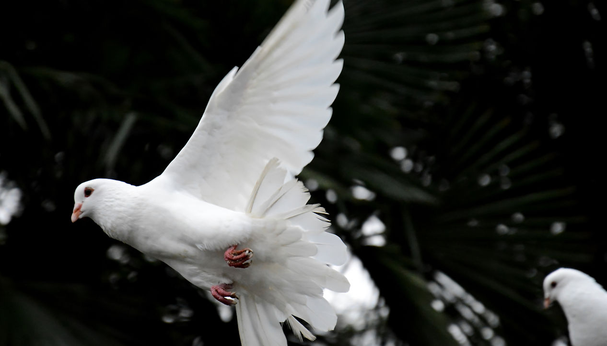

<section class="pomba-hero">
  

    
From the community, for the community

    <h1>Comfort and compassion in grief</h1>
    
Pomba Branca offers comfort and compassion to people affected by grief, loss, and the fear that can accompany the end of life.

    

      <a class="pomba-button" href="services">Our services</a>
      <a class="pomba-button secondary" href="contact">Contact us</a>
    

  

  

    
  

</section>

## How we help

  <article class="pomba-card">
    
    

      <h3>Grief Cafés</h3>
      
Warm, informal gatherings where people can share grief in a safe, respectful, and compassionate space.

      <a href="grief-cafes">Learn more</a>
    

  </article>
  <article class="pomba-card">
    
    

      <h3>End-of-Life Doula</h3>
      
Support, companionship, comfort, and guidance for people at the end of life and for those close to them.

      <a href="doula">Learn more</a>
    

  </article>
  <article class="pomba-card">
    
    

      <h3>Loneliness Support</h3>
      
A volunteer companion network offering listening, presence, and human connection in difficult moments.

      <a href="loneliness-support">Learn more</a>
    

  </article>

## Next steps

If you are grieving, accompanying someone at the end of life, or would like to volunteer, please get in touch.

  <a href="tel:+351968132386"><strong>Phone</strong>(351) 968 132 386</a>
  <a href="mailto:geral@pombabranca.org"><strong>Email</strong>geral@pombabranca.org</a>

